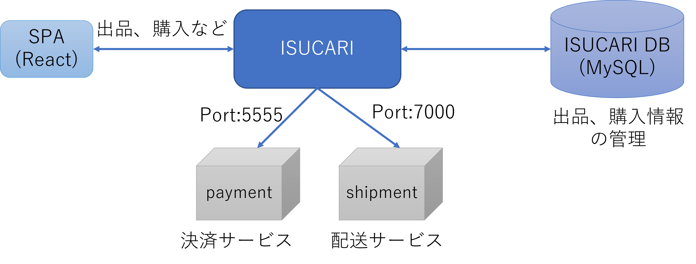

# uls-isucon2

## ディレクトリ構成

```
├── bench        # ベンチマーカーなどが依存するパッケージのソースコード
├── cmd          # ベンチマーカーなどのソースコード
├── initial-data # 初期データ作成
└── webapp       # 各言語の参考実装
```

## ISUCARIストーリー

ISUCARIは椅子を売りたい人／買いたい人をつなげるフリマアプリです。

- 日々開発が進められ、先日もBump機能がリリースされたばかり
- 世界的な椅子ブームを追い風に順調に成長を続け
- さらなる成長を見込み社長は自腹による「ｲｽｺｲﾝ還元キャンペーン」を企画
- しかし「ｲｽｺｲﾝ還元キャンペーン」の驚異的な拡散力により負荷に耐えられないことが発覚
- 社長「緊急メンテナンスをいれていいので18時までに改修しろ。18時にプロモーション開始だ」

アプリケーションの仕様については [アプリケーション仕様書](./webapp/docs/APPLICATION_SPEC.md) を参照



## クイックスタート（ISUCARをブラウザで使うなら編）

Dockerを使用して簡単にアプリケーションのビルド、起動が可能です。
シンボリックリンクがあるため、Windowsの場合はWSL2を使用してください。

### 前準備

```
# 初期データ作成（10分程度時間がかかります）
$ cd initial-data
$ make

# webapp用初期画像データダウンロード（10分程度時間がかかります）
# GitHub releases から initial.zip をダウンロードしてwebapp/public/upload配下に展開
$ cd webapp/public
$ wget --no-check-certificate https://github.com/isucon/isucon9-qualify/releases/download/v2/initial.zip
$ unzip initial.zip
$ rm -rf upload
$ mv v3_initial_data upload
```

### ISUCARIビルド＆起動

```
# Dockerイメージ作成
$ cd webapp/go or webapp/python or webapp/nodejs
$ docker-compose build

# Dockerイメージ作成確認
# app-go/app-python/app-nodejsとdbというイメージがv1.0で作成される（dbはwebapp/sql配下のDockerfile）
$ docker images

# ISUCARI起動
$ docker-compose up -d

# ISUCARI起動確認
$ docker ps

# ISUCARI停止（停止が必要なら）
$ docker-compose down
```

### 外部サービスビルド＆起動

ISUCARIは2つの外部サービスに依存しています。
この2つのサービスをビルドして起動します。

```
# Dockerイメージ作成
$ cd ${repository root directory}
$ docker-compose -f docker-compose-external.yml build

# Dockerイメージ作成確認
# ${reposName}_paymentと${reposName}_shipmentdbというイメージがlatestで作成される
$ docker images

# 外部サービス起動
$ docker-compose -f docker-compose-external.yml up -d

# 外部サービス起動確認
$ docker ps

# ISUCARIの外部サービス接続先を変更
$ curl -XPOST http://127.0.0.1:8000/initialize -d '{"payment_service_url":"http://payment:5555", "shipment_service_url":"http://shipment:7000"}'

# 外部サービス停止（停止が必要なら）
$ docker-compose -f docker-compose-external.yml down
※network削除エラーは問題ありません
```

### ISUCARI動作確認

ブラウザから以下のURLにアクセスするとアプリが表示されます。

http://localhost:8000/

画面の「新規会員登録」から、ユーザを作成あるいは以下のテスト用ユーザが利用できます

| id       | password |
|----------|----------|
| isudemo1 | isudemo1 |
| isudemo2 | isudemo2 |
| isudemo3 | isudemo3 |


## クイックスタート（ベンチマーク実行編）

Dockerを使用して簡単にベンチマーク実行が可能です。
クイックスタート（ISUCARをブラウザで使うなら編）を完了させISUCARが起動済みであることが前提です。
また、ベンチマーカーが外部サービスを自動的に起動するため、外部サービスは停止してください。

### 前準備

```
# ベンチマーカー用画像データダウンロード（10分程度時間がかかります）
# GitHub releases から bench1.zip をダウンロードしてinitial-data/images配下に展開
$ cd initial-data
$ wget --no-check-certificate https://github.com/isucon/isucon9-qualify/releases/download/v2/bench1.zip
$ unzip bench1.zip
$ rm -rf images
$ mv v3_bench1 images
```

### ベンチマーカービルド＆起動

```
# Dockerイメージ作成
$ cd ${repository root directory}
$ docker-compose build

# Dockerイメージ作成確認
# ${reposName}_benchmarkerというイメージがlatestで作成される
$ docker images

# ベンチマーカー起動
$ docker-compose up
```

## ULS杯ISUCON#2マニュアル

[ULS杯ISUCON#2マニュアル](./docs/manual.md)

## 使用データの取得元

- なんちゃって個人情報 http://kazina.com/dummy/
- 椅子画像提供 941-san https://twitter.com/941/status/1157193422127505412
